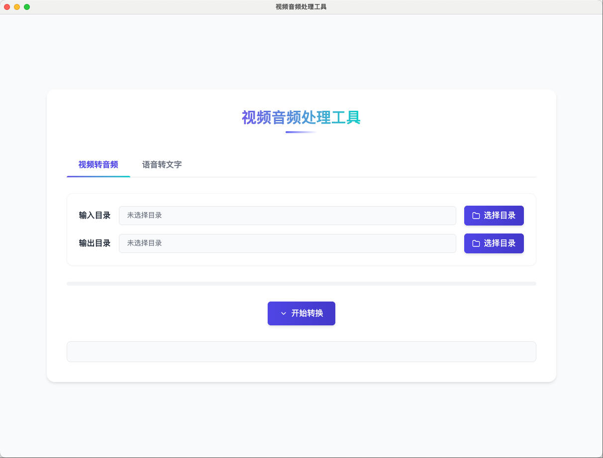
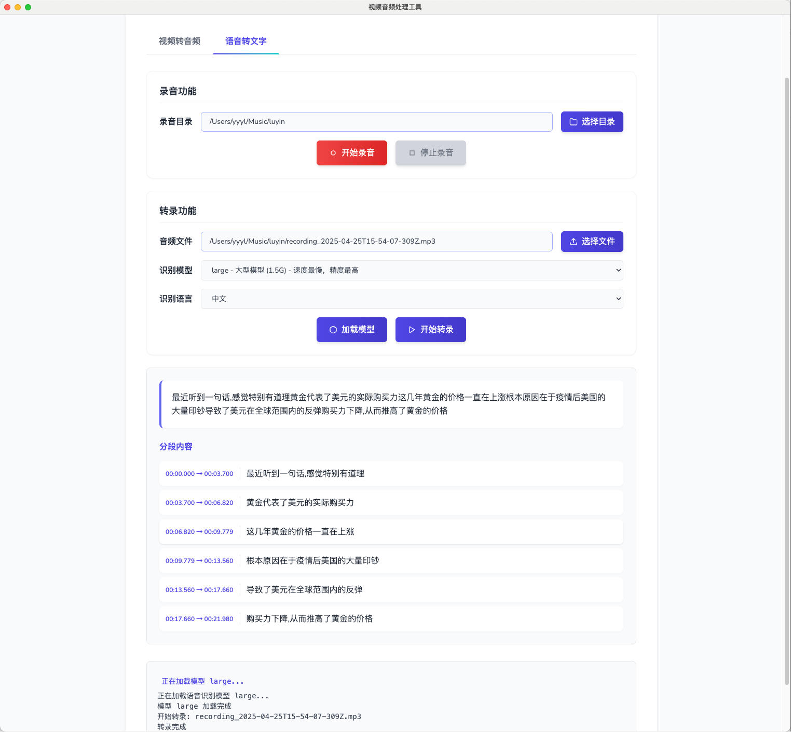

# 视频音频处理工具

一个多功能的视频和音频处理工具，具有以下功能：

1. 视频转音频：将视频文件批量转换为 MP3 格式
2. 语音转文本：使用 OpenAI Whisper 模型将语音内容转换为文本
3. 录音功能：支持在线录音并保存为音频文件

## 依赖项

- Python 3.9+
- FFmpeg
- OpenAI Whisper

## 安装

1. 安装 Python 依赖

```bash
pip install eel openai-whisper
```

2. 安装 FFmpeg

**macOS:**
```bash
brew install ffmpeg
```

**Ubuntu/Debian:**
```bash
sudo apt update && sudo apt install ffmpeg
```

**Windows:**
```bash
choco install ffmpeg
```

## 使用方法

1. 运行应用

```bash
python main.py
```

2. 使用视频转音频功能
   - 点击"视频转音频"标签
   - 选择包含视频文件的输入目录
   - 选择输出目录
   - 点击"开始转换"

3. 使用语音转文本功能
   - 点击"语音转文字"标签
   - 选择音频或视频文件
   - 选择合适的模型（tiny、base、small、medium、large）
   - 选择语言（或使用自动检测）
   - 点击"加载模型"，然后点击"开始转录"

4. 使用录音功能
   - 点击"录音"标签
   - 点击"开始录音"按钮开始录制
   - 录音完成后点击"停止录音"按钮
   - 录音将自动保存到指定目录

## 效果展示

### 视频转音频

视频转音频功能使用 FFmpeg 将视频文件转换为 MP3 格式的音频文件，支持批量处理。



### 语音转文本

语音转文本功能使用 OpenAI Whisper 模型将语音内容转换为文本，支持多种语言和不同大小的模型。



### 录音功能

录音功能提供在线录音并保存为音频文件的功能，录音数据通过前端 Web Audio API 采集，后端提供保存功能。
